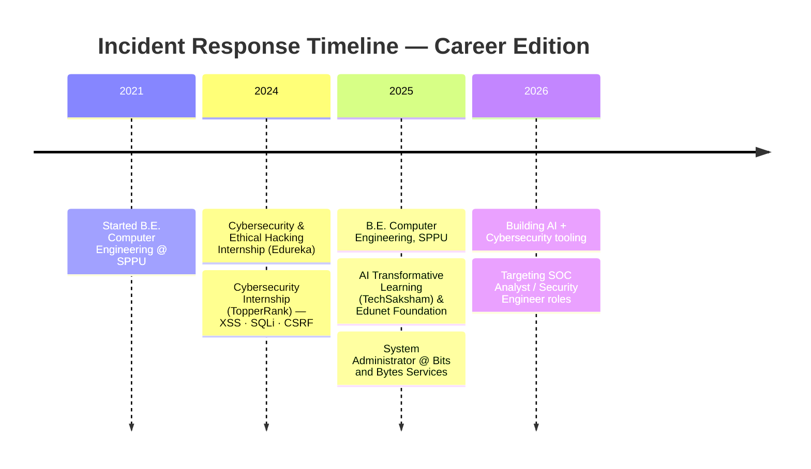

<div align="center">

<!-- Terminal-style animated header -->


</div>

<p align="center">
  
</p>

<div align="center">

&color=00ff9c&style=for-the-badge&labelColor=0d1117)
[](https://www.linkedin.com/in/gauravghandat-68a5a22b4)
[](mailto:gauravghandat12@gmail.com)
[](#)

</div>

---

<table align="center">
<tr>
<td width="60%" valign="top">

### 📟 SYSTEM LOG — `whoami`

```yaml
name:        Gaurav Ghandat
role:        SOC Analyst | System Administrator
location:    Nashik, Maharashtra, India
current_org: Bits and Bytes Services
clearance:   Blue Team | Threat Hunter
mission:     >
  Analyzing security events, correlating logs, and
  hunting adversaries across enterprise environments —
  one alert at a time.
focus:
  - Security Monitoring & SIEM (Splunk)
  - Threat Detection & Incident Response
  - Active Directory & Windows Server Hardening
  - Linux Administration & Network Security
seeking:     [SOC Analyst L1, Security Ops Analyst, Blue Team Analyst]
status:      🟢 ACTIVELY MONITORING
```

</td>
<td width="40%" valign="top">

### 🛰️ THREAT DASHBOARD

```
┌──────────────────────────────┐
│  ALERT FEED                  │
├──────────────────────────────┤
│  [INFO]  System hardened     │
│  [INFO]  IOC extracted       │
│  [WARN]  Anomaly detected    │
│  [OK]    Incident contained  │
│  [OK]    Playbook executed   │
│  [INFO]  MITRE ATT&CK mapped │
└──────────────────────────────┘
   Uptime: 100% Vigilance
```

</td>
</tr>
</table>

---

## 🧠 CORE ARSENAL

<div align="center">

**Security Operations**


**Infrastructure & Systems**


**Cloud & DevOps**


**Development & AI Tooling**


</div>

---

## 🎯 MISSION LOG — Featured Builds

<table>
<tr>
<td width="50%" valign="top">

### 🕵️ AI Security Operations Center Assistant (AI‑SOCA)
Full-stack SOC platform combining Streamlit + Groq LLM with log parsing, **IOC extraction**, **MITRE ATT&CK mapping**, NIST SP 800‑61 playbook generation, RBAC + bcrypt auth, and automated PDF incident reporting.

`Python` `Streamlit` `Groq API` `SQLite` `MITRE ATT&CK`

</td>
<td width="50%" valign="top">

### 🎣 AI Phishing & Fraud Detection System
Dark SOC-console styled ML platform for phishing/fraud triage — fraud risk scoring engine, bulk CSV scanning, and full scan-history tracking built on scikit-learn.

`Python` `Streamlit` `scikit-learn` `ML`

</td>
</tr>
<tr>
<td width="50%" valign="top">

### 🌐 VPN & Proxy Detection Platform
Flask + SQLAlchemy defensive tool that geolocates and heuristically classifies IPs (TOR/VPN/PROXY/HOSTING/RESIDENTIAL) with a REST API, risk scoring, RBAC, and multi-format export (CSV/Excel/PDF).

`Flask` `SQLAlchemy` `REST API` `Risk Scoring`

</td>
<td width="50%" valign="top">

### 📡 Network Monitoring System (NMS)
Production backend polling 200+ devices via **ICMP · SNMPv2c · WMI · SSH**, feeding a live NOC dashboard in Power BI — deployed against a real network in Nashik.

`pysnmp` `psutil` `Power BI` `NOC`

</td>
</tr>
<tr>
<td width="50%" valign="top">

### 🔬 AI Vulnerability Scanner
Production-grade scanner combining Streamlit and Groq LLM for automated vulnerability analysis and reporting.

`Python` `Streamlit` `Groq API`

</td>
<td width="50%" valign="top">

### 🏴 NITS CyberGyan — CTF Platform
FastAPI + Streamlit CTF platform with JWT auth, a 3-tier Groq-powered AI hint engine, gamified badges/leaderboard, and 8 challenge categories.

`FastAPI` `JWT` `Groq API` `Gamification`

</td>
</tr>
</table>

<div align="center">

*More recon in progress: SIEM + GNN-based threat detection · Quantum-resistant cryptography · Digital Forensics*

</div>

---

## 📊 TELEMETRY

<div align="center">


</div>

---

## 🎓 CERTIFICATIONS & TRAINING

<div align="center">

| 🏅 Credential | 
|---|
| Oracle Cloud Infrastructure 2025 Certified Architect Associate |
| AIG's Shields Up: Cybersecurity Job Simulation |
| Threats to Websites |
| AWS APAC Solutions Architecture |
| CCNA · MCSA · RHCE · RHCSA |
| Microsoft — Intro to Computers, OS & Security |

</div>

---

## 🗺️ CAREER PATH



---

<div align="center">

### 📡 Let's Connect

[](https://www.linkedin.com/in/gauravghandat-68a5a22b4)
[](mailto:gauravghandat12@gmail.com)

<br/>

`"In God we trust. All others, we monitor." — SOC Motto`


</div>
