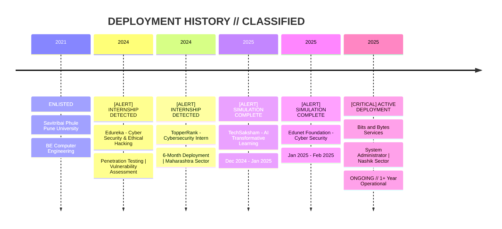

<div align="center">

<!-- ═══════════════════════════════════════════════════════════════ -->
<!-- ║  SOC ANALYST PROFILE v3.0.1  |  CLASSIFICATION: PUBLIC      ║ -->
<!-- ║  CLEARANCE: CERTIFIED OPERATOR  |  ORIGIN: NASHIK, IN       ║ -->
<!-- ═══════════════════════════════════════════════════════════════ -->

<pre>
╔═══════════════════════════════════════════════════════════════════════════════════════════════════╗
║  <span style="color:#00f5d4">██████╗  █████╗ ██╗   ██╗██████╗  █████╗ ██╗   ██╗     </span>       ║
║  <span style="color:#00f5d4">██╔════╝ ██╔══██╗██║   ██║██╔══██╗██╔══██╗██║   ██║    </span>       ║
║  <span style="color:#00f5d4">██║  ███╗███████║██║   ██║██████╔╝███████║██║   ██║    </span>       ║
║  <span style="color:#00f5d4">██║   ██║██╔══██║╚██╗ ██╔╝██╔══██╗██╔══██║╚██╗ ██╔╝    </span>       ║
║  <span style="color:#00f5d4">╚██████╔╝██║  ██║ ╚████╔╝ ██║  ██║██║  ██║ ╚████╔╝     </span>       ║
║   <span style="color:#00f5d4">╚═════╝ ╚═╝  ╚═╝  ╚═══╝  ╚═╝  ╚═╝╚═╝  ╚═╝  ╚═══╝      </span>       ║
║                                                                                                   ║
║   <span style="color:#ff006e">GHANDAT</span>                                                      ║
║                                                                                                   ║
║   [THREAT_LEVEL: HIGH] // BLUE_TEAM_OPERATOR // SOC_TIER_1_ANALYST                                ║
╚═══════════════════════════════════════════════════════════════════════════════════════════════════╝
</pre>

<!-- Animated Header -->
<a href="https://git.io/typing-svg">
  
</a>

<br>

<!-- Custom Terminal Banner -->


<br><br>

<!-- Status Indicators -->
<table align="center">
  <tr>
    <td></td>
    <td></td>
    <td></td>
    <td></td>
  </tr>
</table>

<!-- Quick Links -->
<p align="center">
  <a href="https://www.linkedin.com/in/gaurav-ghandat-68a5a22b4/" target="_blank">
    
  </a>
  <a href="https://github.com/GauravGhandat-23" target="_blank">
    
  </a>
  <a href="https://my-portfolio-lgfc.vercel.app/" target="_blank">
    
  </a>
  <a href="mailto:gauravghandat23@gmail.com" target="_blank">
    
  </a>
</p>

</div>

---

<!-- ═══════════════════════════════════════════════════════════════ -->
<!-- ║  SECTION 01: OPERATOR PROFILE                                ║ -->
<!-- ═══════════════════════════════════════════════════════════════ -->

##  `OPERATOR_PROFILE.dat`

```yaml
OPERATOR_ID    : GHANDAT-GAURAV-23
DESIGNATION    : SOC Analyst | Blue Team Operator
CLEARANCE      : Certified Security Professional
SECTOR         : Nashik, Maharashtra, India
STATUS         : ACTIVE // SEEKING_DEPLOYMENT
COMM_CHANNEL   : gauravghandat23@gmail.com
NETWORK_NODE   : linkedin.com/in/gaurav-ghandat-68a5a22b4

MISSION_BRIEF:
  SOC Analyst and System Administrator with hands-on deployment experience
  in Security Monitoring, Splunk SIEM, Threat Detection, Incident Response,
  Windows Server, Linux Administration, and Active Directory.

  Specialized in analyzing security events, investigating alerts, and
  identifying suspicious activities using SIEM platforms.

  Core competencies include log analysis, user access management, security
  hardening, vulnerability remediation, and supporting enterprise IT infrastructure.

OPERATIONAL_CAPABILITIES:
  - Splunk Enterprise SIEM
  - Security Monitoring & Event Correlation
  - Threat Detection & Incident Response
  - Active Directory & Windows Server
  - Linux Administration & Hardening
  - Network Security (DNS, DHCP, VPN)
  - PowerShell & Python Automation
  - MITRE ATT&CK Framework
  - OWASP Top 10

TARGET_ROLES:
  - SOC Analyst (L1)
  - Security Operations Analyst
  - Cybersecurity Analyst
  - Blue Team Analyst
```

---

<!-- ═══════════════════════════════════════════════════════════════ -->
<!-- ║  SECTION 02: SECURITY POSTURE DASHBOARD                      ║ -->
<!-- ═══════════════════════════════════════════════════════════════ -->

##  `SECURITY_POSTURE.dashboard`

<div align="center">

<table width="90%">
  <tr>
    <td width="25%" align="center">
      <br><br>
      <b>Splunk Enterprise</b><br>
      <code>██████████░░ 85%</code>
    </td>
    <td width="25%" align="center">
      <br><br>
      <b>Threat Detection</b><br>
      <code>█████████░░░ 80%</code>
    </td>
    <td width="25%" align="center">
      <br><br>
      <b>Incident Response</b><br>
      <code>█████████░░░ 80%</code>
    </td>
    <td width="25%" align="center">
      <br><br>
      <b>Log Analysis</b><br>
      <code>██████████░░ 85%</code>
    </td>
  </tr>
  <tr><td colspan="4"><br></td></tr>
  <tr>
    <td width="25%" align="center">
      <br><br>
      <b>Active Directory</b><br>
      <code>██████████░░ 85%</code>
    </td>
    <td width="25%" align="center">
      <br><br>
      <b>Windows Server</b><br>
      <code>█████████░░░ 80%</code>
    </td>
    <td width="25%" align="center">
      <br><br>
      <b>Linux Administration</b><br>
      <code>██████████░░ 85%</code>
    </td>
    <td width="25%" align="center">
      <br><br>
      <b>Network Security</b><br>
      <code>█████████░░░ 80%</code>
    </td>
  </tr>
  <tr><td colspan="4"><br></td></tr>
  <tr>
    <td width="25%" align="center">
      <br><br>
      <b>Python</b><br>
      <code>█████████░░░ 80%</code>
    </td>
    <td width="25%" align="center">
      <br><br>
      <b>PowerShell</b><br>
      <code>██████████░░ 85%</code>
    </td>
    <td width="25%" align="center">
      <br><br>
      <b>MITRE ATT&CK</b><br>
      <code>█████████░░░ 80%</code>
    </td>
    <td width="25%" align="center">
      <br><br>
      <b>OWASP Top 10</b><br>
      <code>██████████░░ 85%</code>
    </td>
  </tr>
</table>

</div>

---

<!-- ═══════════════════════════════════════════════════════════════ -->
<!-- ║  SECTION 03: MITRE ATT&CK COVERAGE MAP                       ║ -->
<!-- ═══════════════════════════════════════════════════════════════ -->

##  `MITRE_ATT&CK.coverage`

```
┌─────────────────────────────────────────────────────────────────────────────┐
│  MITRE ATT&CK FRAMEWORK v14.1  |  COVERAGE MATRIX                           │
├─────────────────────────────────────────────────────────────────────────────┤
│                                                                             │
│  INITIAL ACCESS        ████████░░  80%  [Phishing, Supply Chain]           │
│  EXECUTION             ████████░░  80%  [PowerShell, Command Line]         │
│  PERSISTENCE           ███████░░░  70%  [Registry, Scheduled Tasks]        │
│  PRIVILEGE ESCALATION  ███████░░░  70%  [Token Impersonation, Sudo]        │
│  DEFENSE EVASION       ███████░░░  70%  [Clear Logs, Masquerading]         │
│  CREDENTIAL ACCESS     ████████░░  80%  [Brute Force, Credential Dumping]  │
│  DISCOVERY             █████████░  90%  [Network, Account, File]           │
│  LATERAL MOVEMENT      ██████░░░░  60%  [Remote Services, SSH]             │
│  COLLECTION            ████████░░  80%  [Email, Clipboard Data]            │
│  COMMAND & CONTROL     ███████░░░  70%  [DNS Tunneling, Encrypted Channel] │
│  EXFILTRATION          ███████░░░  70%  [C2, Cloud Storage]                │
│  IMPACT                ████████░░  80%  [Data Encryption, Service Stop]    │
│                                                                             │
│  OVERALL COVERAGE: ████████░░  78%                                         │
│  STATUS: [OPERATIONAL]                                                      │
└─────────────────────────────────────────────────────────────────────────────┘
```

---

<!-- ═══════════════════════════════════════════════════════════════ -->
<!-- ║  SECTION 04: OPERATIONAL TIMELINE                            ║ -->
<!-- ═══════════════════════════════════════════════════════════════ -->

##  `OPERATIONAL_TIMELINE.log`



---

<!-- ═══════════════════════════════════════════════════════════════ -->
<!-- ║  SECTION 05: CASE FILES (EXPERIENCE)                         ║ -->
<!-- ═══════════════════════════════════════════════════════════════ -->

##  `CASE_FILES/`

<details>
<summary><b>🚨 CASE-001: Bits and Bytes Services | System Administrator [ACTIVE]</b></summary>
<br>

```
┌────────────────────────────────────────────────────────────────────┐
│  CASE ID: BBS-SYSADM-2025-001                                    │
│  STATUS: ACTIVE DEPLOYMENT                                       │
│  DURATION: June 2025 - Present (1+ Year)                         │
│  LOCATION: Nashik, Maharashtra, India                            │
├────────────────────────────────────────────────────────────────────┤
│  OPERATIONS CONDUCTED:                                           │
│  • System administration across enterprise Windows/Linux infra     │
│  • Active Directory management & Group Policy enforcement          │
│  • DNS/DHCP/VPN configuration & troubleshooting                    │
│  • Security hardening & vulnerability remediation                  │
│  • User access management & privilege escalation monitoring        │
│  • Log analysis & event correlation for anomaly detection          │
└────────────────────────────────────────────────────────────────────┘
```
</details>

<details>
<summary><b>📁 CASE-002: Edunet Foundation | Cyber Security [CLOSED]</b></summary>
<br>

```
┌────────────────────────────────────────────────────────────────────┐
│  CASE ID: EDF-CYBER-2025-001                                     │
│  STATUS: CLOSED // SIMULATION COMPLETE                           │
│  DURATION: January 2025 - February 2025 (2 months)               │
│  LOCATION: India                                                 │
├────────────────────────────────────────────────────────────────────┤
│  OPERATIONS CONDUCTED:                                           │
│  • Cybersecurity fundamentals & practical application              │
│  • Security awareness training modules                             │
│  • Basic threat landscape analysis                                 │
└────────────────────────────────────────────────────────────────────┘
```
</details>

<details>
<summary><b>📁 CASE-003: TechSaksham | AI Transformative Learning [CLOSED]</b></summary>
<br>

```
┌────────────────────────────────────────────────────────────────────┐
│  CASE ID: TSK-AI-2024-001                                        │
│  STATUS: CLOSED // SIMULATION COMPLETE                           │
│  DURATION: December 2024 - January 2025 (2 months)               │
│  LOCATION: India                                                 │
├────────────────────────────────────────────────────────────────────┤
│  OPERATIONS CONDUCTED:                                           │
│  • AI-driven cybersecurity solutions exploration                   │
│  • Transformative learning with tech integration                   │
│  • Emerging threat detection using ML concepts                     │
└────────────────────────────────────────────────────────────────────┘
```
</details>

<details>
<summary><b>📁 CASE-004: TopperRank | Cybersecurity Intern [CLOSED]</b></summary>
<br>

```
┌────────────────────────────────────────────────────────────────────┐
│  CASE ID: TPR-CYBER-2024-001                                     │
│  STATUS: CLOSED // 6-MONTH DEPLOYMENT COMPLETE                   │
│  DURATION: July 2024 - December 2024 (6 months)                  │
│  LOCATION: Maharashtra, India                                    │
├────────────────────────────────────────────────────────────────────┤
│  OPERATIONS CONDUCTED:                                           │
│  • Hands-on cybersecurity operations & monitoring                  │
│  • Vulnerability assessment & security posture analysis            │
│  • Incident documentation & reporting procedures                   │
│  • Collaboration with security teams for threat mitigation         │
└────────────────────────────────────────────────────────────────────┘
```
</details>

<details>
<summary><b>📁 CASE-005: Edureka | Cyber Security & Ethical Hacking [CLOSED]</b></summary>
<br>

```
┌────────────────────────────────────────────────────────────────────┐
│  CASE ID: EDR-CEH-2024-001                                       │
│  STATUS: CLOSED // 5-MONTH DEPLOYMENT COMPLETE                   │
│  DURATION: February 2024 - June 2024 (5 months)                  │
│  LOCATION: India                                                 │
├────────────────────────────────────────────────────────────────────┤
│  OPERATIONS CONDUCTED:                                           │
│  • Penetration testing on web applications                         │
│  • Discovered 12+ vulnerabilities (SQLi, XSS, etc.)                │
│  • Vulnerability assessments improving security by ~40%            │
│  • Attack surface mapping using Nmap & Shodan                      │
│  • Linux system hardening (SSH, password policies)                 │
│  • OSINT investigations for exposed credentials & assets           │
└────────────────────────────────────────────────────────────────────┘
```
</details>

---

<!-- ═══════════════════════════════════════════════════════════════ -->
<!-- ║  SECTION 06: CERTIFICATIONS & CLEARANCE LEVELS               ║ -->
<!-- ═══════════════════════════════════════════════════════════════ -->

##  `CERTIFICATIONS.db`

<div align="center">

### 🔐 SECURITY CLEARANCE LEVELS

<table width="95%">
  <tr>
    <td width="50%" align="center">
      <h4>🛡️ CLOUD & INFRASTRUCTURE</h4>
      <p>
        
        <br><br>
        
      </p>
    </td>
    <td width="50%" align="center">
      <h4>🎓 CYBERSECURITY FUNDAMENTALS</h4>
      <p>
        
        <br><br>
        
        <br><br>
        
        <br><br>
        
      </p>
    </td>
  </tr>
  <tr>
    <td width="50%" align="center">
      <h4>🏢 JOB SIMULATIONS</h4>
      <p>
        
        <br><br>
        
        <br><br>
        
      </p>
    </td>
    <td width="50%" align="center">
      <h4>🖥️ SYSTEMS & SECURITY</h4>
      <p>
        
        <br><br>
        
        <br><br>
        
        <br><br>
        
        <br><br>
        
      </p>
    </td>
  </tr>
</table>

</div>

---

<!-- ═══════════════════════════════════════════════════════════════ -->
<!-- ║  SECTION 07: ARSENAL (TOOLS)                                 ║ -->
<!-- ═══════════════════════════════════════════════════════════════ -->

##  `ARSENAL/`

```
┌─────────────────────────────────────────────────────────────────────────────┐
│  OPERATOR TOOLKIT  |  VERSION: 3.0.1  |  LAST_UPDATED: 2025-07-28        │
├─────────────────────────────────────────────────────────────────────────────┤
│                                                                             │
│  [SIEM & MONITORING]                                                        │
│  └── Splunk Enterprise    ████████████  SIEM Dashboard & Alert Correlation │
│  └── Security Monitoring  ████████████  Real-time Event Analysis           │
│                                                                             │
│  [OFFENSIVE TOOLS]                                                          │
│  └── Kali Linux           ██████████░░  Penetration Testing Platform       │
│  └── Metasploit           ████████░░░░  Exploitation Framework             │
│  └── Burp Suite           ██████████░░  Web App Security Testing           │
│  └── Nmap                 ████████████  Network Discovery & Mapping        │
│  └── Wireshark            ██████████░░  Packet Analysis & PCAP             │
│                                                                             │
│  [DEFENSIVE TOOLS]                                                          │
│  └── Splunk SIEM          ████████████  Log Ingestion & Threat Hunting     │
│  └── MITRE ATT&CK         ██████████░░  TTP Mapping & Detection            │
│  └── OSINT Framework      ████████░░░░  Digital Reconnaissance             │
│                                                                             │
│  [SYSTEMS ADMINISTRATION]                                                   │
│  └── Windows Server       ██████████░░  AD, DNS, DHCP, GPO Management     │
│  └── Linux (RHCSA/RHCE)   ████████████  System Hardening & Automation      │
│  └── Active Directory     ████████████  Identity & Access Management       │
│  └── VPN/DNS/DHCP         ██████████░░  Network Infrastructure             │
│                                                                             │
│  [AUTOMATION & SCRIPTING]                                                   │
│  └── Python               ██████████░░  Security Automation & Tooling      │
│  └── PowerShell           ████████████  Windows Automation & Forensics     │
│  └── Bash/Shell           ██████████░░  Linux Scripting & Pipelines        │
│  └── SQL                  ████████░░░░  Database Query & Analysis          │
│                                                                             │
│  [PLATFORMS]                                                                │
│  └── Git/GitHub           ████████████  Version Control & Collaboration    │
│  └── Streamlit            ████████░░░░  Security Dashboard Development     │
│  └── Docker               ███████░░░░░  Containerization Basics            │
│                                                                             │
└─────────────────────────────────────────────────────────────────────────────┘
```

---

<!-- ═══════════════════════════════════════════════════════════════ -->
<!-- ║  SECTION 08: THREAT HUNTING STATS                            ║ -->
<!-- ═══════════════════════════════════════════════════════════════ -->

##  `THREAT_HUNTING.stats`

<div align="center">

<table width="90%">
  <tr>
    <td width="33%" align="center">
      <h1><code>12+</code></h1>
      <p><b>VULNERABILITIES DISCOVERED</b></p>
      <p><sub>SQLi | XSS | Misconfigurations</sub></p>
    </td>
    <td width="33%" align="center">
      <h1><code>~40%</code></h1>
      <p><b>SECURITY POSTURE IMPROVEMENT</b></p>
      <p><sub>Via Vulnerability Assessment</sub></p>
    </td>
    <td width="33%" align="center">
      <h1><code>1+</code></h1>
      <p><b>YEAR ACTIVE DEPLOYMENT</b></p>
      <p><sub>Bits and Bytes Services</sub></p>
    </td>
  </tr>
  <tr>
    <td width="33%" align="center">
      <h1><code>5+</code></h1>
      <p><b>CERTIFICATIONS EARNED</b></p>
      <p><sub>Cloud | Security | Systems</sub></p>
    </td>
    <td width="33%" align="center">
      <h1><code>4</code></h1>
      <p><b>INTERNSHIPS COMPLETED</b></p>
      <p><sub>Edureka | TopperRank | Edunet | TechSaksham</sub></p>
    </td>
    <td width="33%" align="center">
      <h1><code>∞</code></h1>
      <p><b>LEARNING MINDSET</b></p>
      <p><sub>Always Evolving</sub></p>
    </td>
  </tr>
</table>

</div>

---

<!-- ═══════════════════════════════════════════════════════════════ -->
<!-- ║  SECTION 09: GITHUB ANALYTICS                                ║ -->
<!-- ═══════════════════════════════════════════════════════════════ -->

##  `GITHUB_ANALYTICS.log`

<div align="center">

<table width="100%">
  <tr>
    <td width="50%" align="center">
      
    </td>
    <td width="50%" align="center">
      
    </td>
  </tr>
</table>

<table width="100%">
  <tr>
    <td width="40%" align="center">
      
    </td>
    <td width="60%" align="center">
      
    </td>
  </tr>
</table>


</div>

---

<!-- ═══════════════════════════════════════════════════════════════ -->
<!-- ║  SECTION 10: CURRENT OPERATIONS                              ║ -->
<!-- ═══════════════════════════════════════════════════════════════ -->

##  `CURRENT_OPS.status`

<div align="center">

```
┌─────────────────────────────────────────────────────────────────────────────┐
│  ACTIVE MISSIONS  |  PRIORITY: HIGH                                        │
├─────────────────────────────────────────────────────────────────────────────┤
│                                                                             │
│  [MISSION-001]  SOC Analyst L1 Role Acquisition                            │
│  STATUS: IN_PROGRESS  |  PRIORITY: CRITICAL                                │
│  TARGET: Security Operations Analyst | Cybersecurity Analyst | Blue Team   │
│                                                                             │
│  [MISSION-002]  Advanced SIEM & Threat Hunting Certification               │
│  STATUS: TRAINING  |  PRIORITY: HIGH                                       │
│  TARGET: Splunk Core Certified Power User | CompTIA Security+              │
│                                                                             │
│  [MISSION-003]  Cloud Security Specialization                              │
│  STATUS: IN_PROGRESS  |  PRIORITY: MEDIUM                                  │
│  TARGET: AWS Security Specialty | Azure Security Engineer                  │
│                                                                             │
│  [MISSION-004]  CTF & Bug Bounty Practice                                  │
│  STATUS: ACTIVE  |  PRIORITY: MEDIUM                                       │
│  TARGET: TryHackMe | Hack The Box | PicoCTF | HackerOne                    │
│                                                                             │
└─────────────────────────────────────────────────────────────────────────────┘
```

<p>
  
  
  
  
</p>

</div>

---

<!-- ═══════════════════════════════════════════════════════════════ -->
<!-- ║  SECTION 11: EDUCATION RECORDS                               ║ -->
<!-- ═══════════════════════════════════════════════════════════════ -->

##  `EDUCATION_RECORDS.db`

<div align="center">

<table width="90%">
  <tr>
    <td width="100%" align="left">
      <h3>🎓 Savitribai Phule Pune University</h3>
      <p><code>Bachelor of Engineering (BE) — Computer Engineering</code></p>
      <p><code>DURATION: October 2021 - April 2025 | STATUS: COMPLETED</code></p>
    </td>
  </tr>
  <tr><td><br></td></tr>
  <tr>
    <td width="100%" align="left">
      <h3>📚 Progressive Science and Commerce JR College</h3>
      <p><code>Higher Secondary Certificate (HSC) — Science</code></p>
      <p><code>DURATION: September 2019 - February 2021 | STATUS: COMPLETED</code></p>
    </td>
  </tr>
  <tr><td><br></td></tr>
  <tr>
    <td width="100%" align="left">
      <h3>🏫 Deolali High School</h3>
      <p><code>Secondary School Certificate (SSC)</code></p>
      <p><code>LOCATION: India | STATUS: COMPLETED</code></p>
    </td>
  </tr>
</table>

</div>

---

<!-- ═══════════════════════════════════════════════════════════════ -->
<!-- ║  SECTION 12: SECURE COMMUNICATION CHANNELS                   ║ -->
<!-- ═══════════════════════════════════════════════════════════════ -->

##  `SECURE_COMMS.channels`

<div align="center">

<pre>
╔══════════════════════════════════════════════════════════════════════════════╗
║                                                                              ║
║   📡 ESTABLISH SECURE CONNECTION                                            ║
║                                                                              ║
║   ┌─────────────┐    ┌─────────────┐    ┌─────────────┐    ┌─────────────┐ ║
║   │   LINKEDIN  │◄──►│   GITHUB    │◄──►│  PORTFOLIO  │◄──►│    EMAIL    │ ║
║   │   NODE-01   │    │   NODE-02   │    │   NODE-03   │    │   NODE-04   │ ║
║   └─────────────┘    └─────────────┘    └─────────────┘    └─────────────┘ ║
║         ▲                  ▲                  ▲                  ▲           ║
║         └──────────────────┴──────────────────┴──────────────────┘           ║
║                              │                                               ║
║                              ▼                                               ║
║                    ┌─────────────────┐                                       ║
║                    │  OPERATOR BASE  │                                       ║
║                    │  NASHIK, INDIA  │                                       ║
║                    └─────────────────┘                                       ║
║                                                                              ║
╚══════════════════════════════════════════════════════════════════════════════╝
</pre>

<p>
  <a href="https://www.linkedin.com/in/gaurav-ghandat-68a5a22b4/" target="_blank">
    
  </a>
  <a href="https://github.com/GauravGhandat-23" target="_blank">
    
  </a>
  <a href="https://my-portfolio-lgfc.vercel.app/" target="_blank">
    
  </a>
  <a href="mailto:gauravghandat23@gmail.com" target="_blank">
    
  </a>
</p>

<p>
  
</p>

**💼 DEPLOYMENT TARGETS:**
`SOC Analyst (L1)` | `Security Operations Analyst` | `Cybersecurity Analyst` | `Blue Team Analyst`

🧠 *"In the world of cybersecurity, the only constant is evolution. Stay vigilant."*

⭐ **If this profile added value to your mission, consider starring the repositories.**

</div>

---

<!-- ═══════════════════════════════════════════════════════════════ -->
<!-- ║  FOOTER  |  END OF TRANSMISSION                              ║ -->
<!-- ═══════════════════════════════════════════════════════════════ -->

<div align="center">

<pre>
╔══════════════════════════════════════════════════════════════════════════════╗
║  END OF TRANSMISSION  |  SESSION TERMINATED  |  STAY SECURE, OPERATOR       ║
╚══════════════════════════════════════════════════════════════════════════════╝
</pre>

<!-- Animated Footer Wave -->


<!-- Contribution Snake -->
<picture>
  <source media="(prefers-color-scheme: dark)" srcset="https://raw.githubusercontent.com/GauravGhandat-23/GauravGhandat-23/output/github-contribution-grid-snake-dark.svg" />
  <source media="(prefers-color-scheme: light)" srcset="https://raw.githubusercontent.com/GauravGhandat-23/GauravGhandat-23/output/github-contribution-grid-snake.svg" />
  
</picture>

<br>


</div>

<!-- ═══════════════════════════════════════════════════════════════ -->
<!-- ║  EOF  |  Gaurav Ghandat  |  SOC Analyst  |  Blue Team       ║ -->
<!-- ═══════════════════════════════════════════════════════════════ -->
