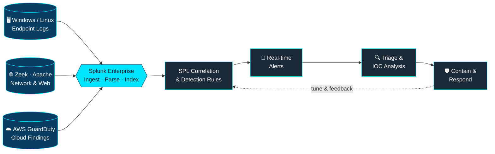

<div align="center">


<a href="https://github.com/GauravGhandat-23">
  
</a>

<br/>


</div>

---

## 🖥️ `whoami`

```bash
gaurav@soc-nashik:~$ whoami
gaurav_uttam_ghandat  # SOC Analyst | System Administrator | Blue Teamer

gaurav@soc-nashik:~$ cat /etc/mission
Turn noisy logs into high-fidelity detections,
and high-fidelity detections into fast decisions.

gaurav@soc-nashik:~$ cat ~/.stack
SIEM      : Splunk Enterprise (SPL, dashboards, alerting, correlation)
FRAMEWORK : MITRE ATT&CK | Cyber Kill Chain | OWASP Top 10 | ITIL
INFRA     : Windows Server 2012-2025 | Active Directory | RHEL / Rocky / Ubuntu
LANGUAGES : Python | PowerShell | Bash | SQL

gaurav@soc-nashik:~$ uptime
System Administrator @ Bits & Bytes Services Pvt. Ltd  (since 06/2025)
```

---

## 🔄 How I Work: Detection Pipeline

Every project here follows the same loop: **collect → correlate → alert → triage → respond → tune.**



---

## 🎯 Detection Coverage (MITRE ATT&CK)

| Tactic | Technique | How I detect it | Data source |
|:--|:--|:--|:--|
| Credential Access | **T1110** Brute Force | Failed-auth spikes per source IP within a time window, plus many distinct usernames | Linux SSH / auth logs |
| Command & Control | **T1071.004** DNS | Abnormally long or high-volume queries per host (tunneling patterns) | Zeek `dns.log` |
| Command & Control | **T1071.001** Web Protocols | Near-constant connection intervals with low jitter (beaconing) | Zeek `conn.log` |
| Initial Access | **T1190** Exploit Public-Facing App | Traversal, SQLi and XSS patterns in web requests | Apache access logs |
| Multi-stage | Cross-source correlation | Linking network, host and cloud signals into one attack story | Zeek + SSH + Apache + GuardDuty |

<details>
<summary><b>🔬 Peek inside the detection lab: sample SPL (click to expand)</b></summary>

<br/>

> Index and sourcetype names are examples. Adjust them to your own environment.

**SSH brute-force (T1110)**

```spl
index=linux sourcetype=linux_secure "Failed password"
| rex "from (?<src_ip>\d{1,3}(?:\.\d{1,3}){3})"
| rex "for (?:invalid user )?(?<user>\S+)"
| bin _time span=5m
| stats count AS attempts, dc(user) AS users_tried BY _time, src_ip
| where attempts > 10
| sort - attempts
```

**DNS tunneling (T1071.004)**

```spl
index=zeek sourcetype=bro:dns:json
| eval src='id.orig_h', qlen=len(query)
| stats count AS queries, dc(query) AS unique_queries, avg(qlen) AS avg_len BY src
| where avg_len > 40 AND unique_queries > 100
| sort - unique_queries
```

**C2 beaconing (T1071.001)**

```spl
index=zeek sourcetype=bro:conn:json
| eval src='id.orig_h', dst='id.resp_h'
| sort 0 src dst _time
| streamstats current=f last(_time) AS prev BY src dst
| eval delta=_time-prev
| stats count, avg(delta) AS avg_interval, stdev(delta) AS jitter BY src dst
| where count > 30 AND jitter < 5
```

**Web exploitation attempts (T1190)**

```spl
index=web sourcetype=access_combined
| where match(_raw, "(?i)(\.\./|union(\s|%20|\+)+select|<script|etc/passwd)")
| stats count, values(uri_path) AS paths BY clientip
| sort - count
```

</details>

---

## 📌 Featured Projects

<table>
<tr>
<td width="50%" valign="top">

### 🔹 Enterprise Log Analysis & Threat Detection
`Splunk Enterprise` `Zeek` `Apache` `Linux SSH` `AWS GuardDuty`

- Centralized DNS, HTTP, SSH, Apache and cloud logs in one SIEM
- Wrote SPL detections for brute force, DNS tunneling, malware beaconing and web exploitation
- Built real-time alert rules for incident response
- Correlated multi-source logs to surface advanced attack patterns

</td>
<td width="50%" valign="top">

### 🔹 SOC Monitoring Dashboard
`Splunk Enterprise` `SPL`

- Designed enterprise SOC dashboards for analysts
- Visualized authentication anomalies, attack trends, firewall events and web traffic
- Built brute-force detection views for at-a-glance triage
- Turned raw telemetry into actionable security insight

</td>
</tr>
</table>

---

## 🧰 Tech Arsenal

<table>
<tr>
<td><b>🛡️ SIEM & SOC</b></td>
<td>


</td>
</tr>
<tr>
<td><b>🪟 Windows</b></td>
<td>


</td>
</tr>
<tr>
<td><b>🐧 Linux</b></td>
<td>


</td>
</tr>
<tr>
<td><b>🔧 Security Tools</b></td>
<td>


</td>
</tr>
<tr>
<td><b>⚙️ Automation</b></td>
<td>


</td>
</tr>
<tr>
<td><b>🌐 Networking & Cloud</b></td>
<td>


</td>
</tr>
</table>

---

## 💼 Experience

| | |
|:--|:--|
| **Role** | System Administrator, *Bits & Bytes Services Pvt. Ltd*, Nashik |
| **Since** | 06/2025 |
| **Scope** | Windows Server & Linux infrastructure for enterprise clients |
| **Identity & Access** | Active Directory, Group Policy, DNS, DHCP, user access control |
| **Operations** | SLA-driven L1/L2 support, LAN/WAN & VPN monitoring, ITIL incident management |
| **Security** | System hardening, patch management, backup, access control |
| **Infrastructure** | Server deployment, virtualization, storage and data center operations |

---

## 🏆 Certifications

| Domain | Credentials |
|:--|:--|
| 🔴 **Offensive** |   |
| 🔵 **Defensive** |   |
| ☁️ **Cloud** |  |
| 🛡️ **Cyber Foundations** |     |
| 🖧 **Infrastructure** |      |

---

## 🚀 Where I'm Heading

- [x] Centralized log monitoring and multi-source correlation in Splunk
- [x] Real-time alerting and SOC dashboards
- [ ] Detection-as-code: version-controlled detection rules
- [ ] Automating repetitive triage steps with Python and PowerShell
- [ ] Deeper cloud security monitoring across AWS and OCI

---

## 📊 GitHub Analytics

<div align="center">


</div>

---

## 🐍 Contribution Snake

<div align="center">

<picture>
  <source media="(prefers-color-scheme: dark)" srcset="https://raw.githubusercontent.com/GauravGhandat-23/GauravGhandat-23/output/github-snake-dark.svg"/>
  <source media="(prefers-color-scheme: light)" srcset="https://raw.githubusercontent.com/GauravGhandat-23/GauravGhandat-23/output/github-snake.svg"/>
  
</picture>

</div>

---

## 🎓 Education

**B.E. Computer Engineering**, Brahma Valley College of Engineering, Nashik
`06/2022 – 05/2025` · CGPA **7.66 / 10**

---

## 📫 Let's Connect

<div align="center">

<a href="mailto:gauravghandat23@gmail.com"></a>
<a href="https://linkedin.com/in/gaurav-ghandat-68a5a22b4"></a>
<a href="https://github.com/GauravGhandat-23"></a>

<br/><br/>

<i>🔐 "Securing systems, one log at a time."</i>


</div>
